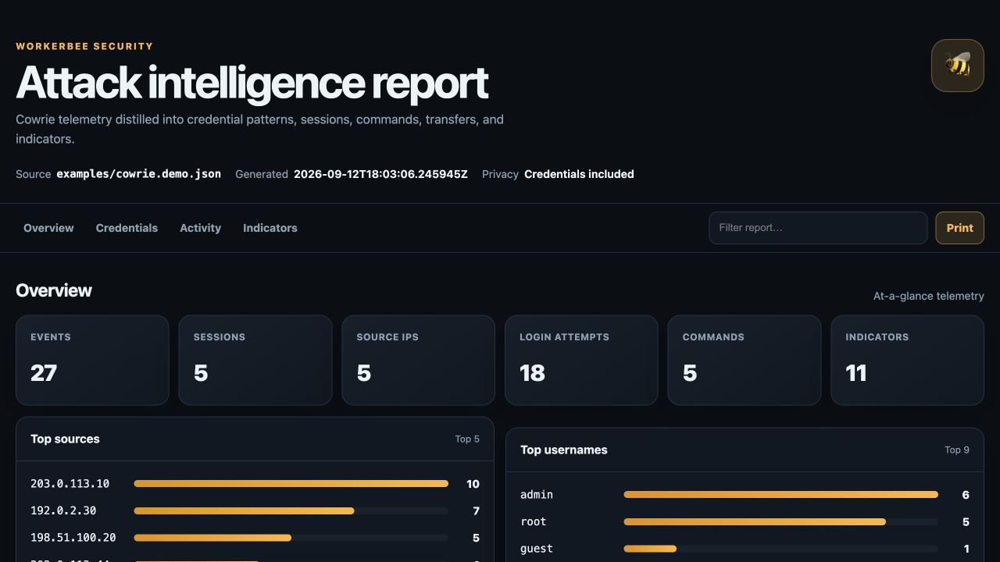

# WorkerBee Security

Security telemetry in. Analyst-ready intelligence out. 🐝

[](https://github.com/VulneraDev/WorkerBeeSecurity/actions/workflows/ci.yml)
[](https://www.python.org/)
[](LICENSE)

WorkerBee Security is an offline-first CLI that turns Cowrie JSON logs into a
compact investigation package. It reconstructs sessions, extracts observables,
records attempted credentials, and exports reports that can move directly into an
analyst workflow.



## Features

- Parses newline-delimited `cowrie.json` events
- Reconstructs logins, commands, downloads, and session timelines
- Ranks usernames, passwords, and credential pairs by frequency and success rate
- Identifies brute-force, password-spray, mixed, repeated, and low-volume sources
- Extracts IPv4, IPv6, domains, URLs, MD5, SHA-1, and SHA-256 indicators
- Produces a self-contained HTML dashboard plus Markdown, JSON, and CSV reports
- Includes attempted usernames and passwords for credential-pattern analysis
- Skips malformed records with useful warnings or fails fast in strict mode
- Optionally enriches public observables with AbuseIPDB and VirusTotal
- Uses only the Python standard library at runtime

## Install

```bash
git clone https://github.com/VulneraDev/WorkerBeeSecurity.git
cd WorkerBeeSecurity
python3 -m venv .venv
source .venv/bin/activate
python -m pip install --upgrade pip
python -m pip install -e .
```

## Quick start

```bash
workerbee analyze /path/to/cowrie.json
```

The default output directory is `workerbee-report/`:

```text
workerbee-report/
├── workerbee-credentials.csv
├── workerbee-indicators.csv
├── workerbee-report.html
├── workerbee-report.json
├── workerbee-report.md
└── workerbee-sessions.csv
```

Choose formats or an output directory:

```bash
workerbee analyze cowrie.json \
  --output reports/case-001 \
  --format html \
  --format markdown \
  --format json
```

Generate a dashboard from the bundled demonstration data:

```bash
workerbee analyze examples/cowrie.demo.json --format html --output reports/demo
```

Open `reports/demo/workerbee-report.html` in any modern browser. The dashboard is a
single offline file with no CDN assets or external requests.

Read from standard input:

```bash
tail -n 5000 cowrie.json | workerbee analyze - --output reports/latest
```

Stop on the first malformed event:

```bash
workerbee analyze cowrie.json --strict
```

Attempted usernames and passwords are included in reports by default. Redact passwords
when creating a report for wider distribution:

```bash
workerbee analyze cowrie.json --redact-credentials
```

Captured credentials can originate from leaked or reused credential lists. Keep raw
reports access-controlled and never test captured passwords against other systems.

## Credential intelligence

WorkerBee ranks attempted usernames, passwords, and credential pairs with attempt
counts, successful logins, success rates, source counts, and first/last-seen times.
Each source is classified from its observed login pattern:

- `brute_force`: at least three attempts against one username with multiple passwords
- `password_spray`: at least three attempts using one password across multiple usernames
- `mixed`: at least three attempts with multiple usernames and passwords
- `repeated`: at least three repeats of one credential pair
- `low_volume`: fewer than three attempts

Password rankings and credential-pair rankings are omitted when
`--redact-credentials` is selected. Counts and source classifications remain available.

## Passive enrichment

Enrichment is disabled by default. When enabled, selected indicators are sent to the
chosen provider for a read-only lookup. WorkerBee does not upload captured files or
request rescans.

AbuseIPDB enriches public IP addresses:

```bash
export ABUSEIPDB_API_KEY="your-key"
workerbee analyze cowrie.json --enrich abuseipdb
```

VirusTotal enriches public IP addresses, domains, URLs, and hashes:

```bash
export VIRUSTOTAL_API_KEY="your-key"
workerbee analyze cowrie.json --enrich virustotal --max-enrich 10
```

Both providers can be selected together. API keys are read from the environment and
are never written to reports.

## What the reports contain

The JSON report is the canonical output. It includes:

- source and generation metadata;
- event and observable counts;
- the most active source addresses;
- normalized sessions with authentication attempts, commands, and downloads;
- credential rankings and source-pattern classifications;
- indicators with first/last seen timestamps and session references;
- bounded enrichment results and parse warnings.

The HTML dashboard is intended for investigation and presentation, while Markdown is
useful for quick review. The CSV files work well with spreadsheets, notebooks, and SIEM
imports.

## Development

```bash
PYTHONPATH=src python3 -m unittest discover -s tests -v
PYTHONPATH=src python3 -m workerbee_security analyze tests/fixtures/cowrie.sample.json
```

See [CONTRIBUTING.md](CONTRIBUTING.md) and [SECURITY.md](SECURITY.md) before opening
an issue or pull request.

WorkerBee Security does not deploy honeypots, execute captured files, or perform
counterattacks.

## License

Apache License 2.0. See [LICENSE](LICENSE).
